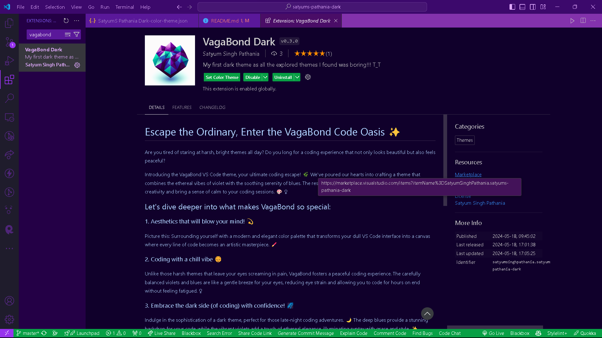
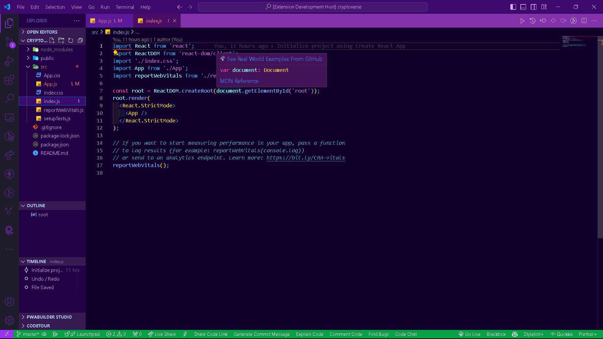

# Escape the Ordinary, Enter the VagaBond Code Oasis ✨

Are you tired of staring at harsh, bright themes all day? Do you long for a coding experience that not only looks beautiful but also feels peaceful?

Introducing the VagaBond VS Code theme, your ultimate coding escape! 🌿 We've poured our hearts into crafting a theme that combines the ethereal vibes of violet with the soothing serenity of blues. The result? A visual masterpiece that will ignite your creativity and bring a sense of calm to your coding sessions. 🎨 ‍♀️

## Let's dive deeper into what makes VagaBond so special:

### 1. Aesthetics that will blow your mind! 💫

Picture this: Surrounding yourself with a modern and elegant color palette that transforms your dull VS Code interface into a canvas where every line of code becomes an artistic masterpiece. 🖌️

### 2. Coding with a chill vibe 😌

Unlike those harsh themes that leave your eyes screaming in pain, VagaBond fosters a peaceful coding experience. The carefully balanced violets and blues are like a gentle breeze for your eyes, reducing eye strain and allowing you to code for hours on end without feeling fatigued. ‍♀️

### 3. Embrace the dark side (of coding) with confidence! 🌌

Indulge in the sophistication of a dark theme, perfect for those late-night coding adventures. 🌙 The deep blues provide a stunning backdrop for your code, while the vibrant violets add a touch of ethereal elegance, illuminating syntax with grace and style. ✨

### 4. Focus like a laser beam! 🔍

VagaBond prioritizes clarity with high-contrast elements that make your code crystal clear. Say goodbye to squinting at poorly highlighted syntax – with VagaBond, your focus will be sharper than ever, leading to increased productivity and smoother coding sessions.
!

## Who can benefit from the VagaBond theme's serene behavior?

- **Developers:** Whether you're a seasoned pro or just starting out, VagaBond provides a professionally stunning and calming coding environment that will help you stay focused and motivated.
- **Programmers:** If you appreciate a modern aesthetic that enhances your ability to concentrate, VagaBond is the theme for you. Say goodbye to distractions and hello to a tranquil coding oasis.
- **Everyone:** Let's face it, eye strain is no fun for anyone. With VagaBond, you can reduce eye strain and enhance code readability in a peaceful atmosphere, making coding a more enjoyable and comfortable experience for everyone.

## Don't just code, create magic in a tranquil space! ✨ 

Download the VagaBond theme today and experience the coding difference for yourself. Trust us, you'll be coding with a smile (and maybe a touch of awe). 😊

## For more information
---
Follow us on social media for updates and more:

- Instagram: [satyum_singh_pathania](https://www.instagram.com/)
- LinkedIn: [Satyum Singh Pathania](https://www.linkedin.com/in/satyum-singh-pathania?utm_source=share&utm_campaign=share_via&utm_content=profile&utm_medium=android_app )

You can also contribute to the development of VagaBond on GitHub:
- [VagaBond GitHub Repository](https://github.com/Satyum-Singh/satyums-pathania-dark.git)

**Enjoy!**
